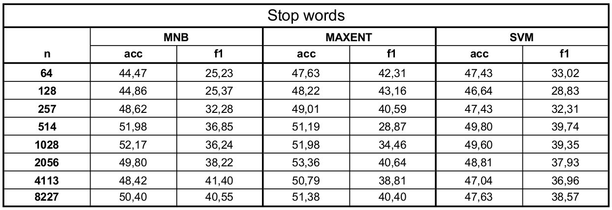
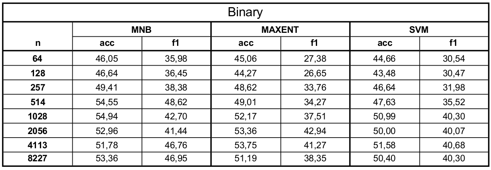
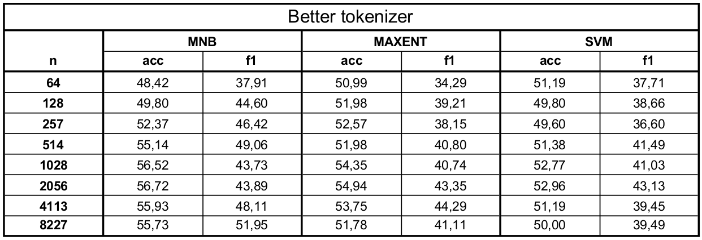
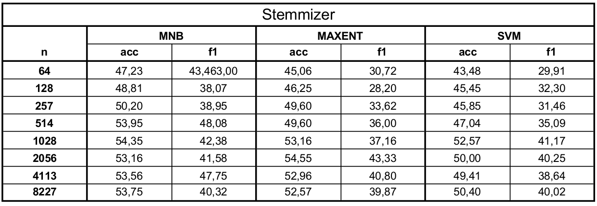

Solución de los ejercicios y datos obtenidos de los mismos
=============
__Ejercicio 1__
========
Se creó un script *stats.py* encargado de imprimir las estadísticas básicas solicitadas.<br>
El mismo contiene una función *printStatistics(reader, corpusName)* que recibe un reader (por ejemplo el InterTASSReader o el GeneralTASSReader) y un nombre de corpus. Este imprime el *corpusName* seguido de la cantidad total de tweets y la cantidad de tweets de cada polaridad (P, N, NEU, NONE).

<pre>
InterTASS
Tweets totales: 1008
Tweets P: 318
Tweets N: 418
Tweets NEU: 133
Tweets NONE: 139

GeneralTASS
Tweets totales: 7219
Tweets P: 1232
Tweets N: 1335
Tweets NEU: 670
Tweets NONE: 1483
</pre>

__Ejercicio 2__
========
Para este ejercicio se decidieron implementar las 4 mejoras correspondientes a *Filtrado de stopwords*, *Binarización de Conteos*, un *Mejor Tokenizer* y el *Stemming*.

Dicha implementación consistió en declarar un diccionario *vectorizers*, donde cada value de cada key es un *callable*.
```python
vectorizers = {
    'stop_words': stop_word_vectorizer,
    'binary': binary_vectorizer,
    'better_tokenizer': better_tokenizer_vectorizer,
    'stemmizer': stemmizer_vectorizer,
    'countVectorizer': CountVectorizer,
}
```
De esta forma podemos acceder al diccionario con el parámetro recibido por parámetro y ejecutar el *callable* para que nos devuelva el Vectorizer elegido. Por ejemplo, si recibimos el parámetro "binary", ejecutar vectorizers["binary"] nos devolverá un *CountVectorizer(binary=True)*.

Los 3 primeros *callables* (stop_word_vectorizer, binary_vectorizer y better_tokenizer_vectorizer) son en particular funciones que instancian y retornan vectorizers. Por otro lado *CountVectorizer* es el *CountVectorizer* estándar y *stemmizer_vectorizer* es una clase que extiende a *CountVectorizer* para overridear el método *build_analizer* y poder aplicar el *Stemming* del español. Esta último desición de diseño fue tomada del [artículo "Customizing-the-vectorizer-classes" de Scikit-Learn](http://scikit-learn.org/stable/modules/feature_extraction.html#customizing-the-vectorizer-classes).<br>
El valor del parámetro vectorizer por default es "countVectorizer". 

Luego de implementarlos, se obtuvieron (con el script *curve.py*) los siguientes datos. Dicho script se utilizó de la siguiente manera:<br>
```bash
python scripts/curve.py -m clf -c {{classifier}} -v {{vectorizer}}
```
donde vectorizer ∈ {stop_words, binary, better_tokenizer, stemmizer} y classifier ∈ {maxent, mnb, svm}






También, se entrenaron modelos con estas 4 mejoras (con el script *train.py*) y luego se evaluaron (con el script *eval.py*).<br> 
El entrenamiento se corrió de esta forma:
```bash
python scripts/train.py -m clf -v stop_words -o clf_stop_words
python scripts/train.py -m clf -v binary -o clf_binary
python scripts/train.py -m clf -v better_tokenizer -o clf_better_tokenizer
python scripts/train.py -m clf -v stemmizer -o clf_stemmizer
```
Mientras que la evaluación fue de esta forma:
```bash
python scripts/eval.py -i clf_stop_words
python scripts/eval.py -i clf_binary
python scripts/eval.py -i clf_better_tokenizer
python scripts/eval.py -i clf_stemmizer
```

Los resultados fueron los siguientes:

__Filtrado de stopwords:__<br>
<pre>
Sentiment P:
  Precision: 50.50% (101/200)
  Recall: 64.74% (101/156)
  F1: 56.74%
Sentiment N:
  Precision: 61.83% (115/186)
  Recall: 52.51% (115/219)
  F1: 56.79%
Sentiment NEU:
  Precision: 17.65% (6/34)
  Recall: 8.70% (6/69)
  F1: 11.65%
Sentiment NONE:
  Precision: 22.09% (19/86)
  Recall: 30.65% (19/62)
  F1: 25.68%
Accuracy: 47.63% (241/506)
Macro-Precision: 38.02%
Macro-Recall: 39.15%
Macro-F1: 38.57%
	P	N	NEU	NONE
P	101	28	6	21	
N	56	115	16	32	
NEU	26	23	6	14	
NONE	17	20	6	19
</pre>

__Binarización de Conteos:__<br>
<pre>
Sentiment P:
  Precision: 54.55% (108/198)
  Recall: 69.23% (108/156)
  F1: 61.02%
Sentiment N:
  Precision: 63.21% (122/193)
  Recall: 55.71% (122/219)
  F1: 59.22%
Sentiment NEU:
  Precision: 15.79% (6/38)
  Recall: 8.70% (6/69)
  F1: 11.21%
Sentiment NONE:
  Precision: 24.68% (19/77)
  Recall: 30.65% (19/62)
  F1: 27.34%
Accuracy: 50.40% (255/506)
Macro-Precision: 39.56%
Macro-Recall: 41.07%
Macro-F1: 40.30%
	P	N	NEU	NONE
P	108	23	10	15	
N	52	122	15	30	
NEU	29	21	6	13	
NONE	9	27	7	19
</pre>

__Mejor Tokenizer:__<br>
<pre>
Sentiment P:
  Precision: 55.43% (102/184)
  Recall: 65.38% (102/156)
  F1: 60.00%
Sentiment N:
  Precision: 63.18% (127/201)
  Recall: 57.99% (127/219)
  F1: 60.48%
Sentiment NEU:
  Precision: 13.51% (5/37)
  Recall: 7.25% (5/69)
  F1: 9.43%
Sentiment NONE:
  Precision: 22.62% (19/84)
  Recall: 30.65% (19/62)
  F1: 26.03%
Accuracy: 50.00% (253/506)
Macro-Precision: 38.69%
Macro-Recall: 40.32%
Macro-F1: 39.49%
	P	N	NEU	NONE
P	102	27	10	17	
N	44	127	14	34	
NEU	26	24	5	14	
NONE	12	23	8	19
</pre>

__Stemming:__<br>
<pre>
Sentiment P:
  Precision: 54.74% (104/190)
  Recall: 66.67% (104/156)
  F1: 60.12%
Sentiment N:
  Precision: 62.69% (126/201)
  Recall: 57.53% (126/219)
  F1: 60.00%
Sentiment NEU:
  Precision: 13.89% (5/36)
  Recall: 7.25% (5/69)
  F1: 9.52%
Sentiment NONE:
  Precision: 25.32% (20/79)
  Recall: 32.26% (20/62)
  F1: 28.37%
Accuracy: 50.40% (255/506)
Macro-Precision: 39.16%
Macro-Recall: 40.93%
Macro-F1: 40.02%
	P	N	NEU	NONE
P	104	24	11	17	
N	48	126	15	30	
NEU	26	26	5	12	
NONE	12	25	5	20
</pre>

Finalmente, para la mejora de *Stemming*, se utilizó la funcion *print_maxent_features* del módulo *sentiment.analysis* para imprimir las features más relevantes para cada sentimiento, el resultado fue el siguiente:
<pre>
N:
	portada buena enhorabuena gracias besos ([-1.57715354 -1.43077936 -1.42759822 -1.41947779 -1.36450292])
	odio déficit recortes muertos triste ([1.6724519  1.68052657 1.78226641 2.04207167 2.42096484])
NEU:
	parados cree enhorabuena cuenta puedes ([-1.11954982 -0.99833537 -0.93920145 -0.90387799 -0.8670128 ])
	decidirán broma palomacervilla expectación huelga ([1.26041253 1.26806314 1.30022578 1.32740269 1.34231887])
NONE:
	feliz gracias interesante gran enhorabuena ([-1.95280773 -1.93897273 -1.84154676 -1.79116806 -1.70262616])
	periódico sesión jugar reunión portada ([1.21813152 1.30945322 1.38032478 1.45742904 2.20772094])
P:
	portada triste culpa urdangarin griñan ([-1.66217174 -1.54530836 -1.42478139 -1.31705283 -1.27911123])
	genial homenaje gracias felicidades enhorabuena ([1.85082741 2.00512272 2.14249476 2.27528371 2.44819998])
</pre>

Un tweet de ejemplo (index: 50) con todos los features que intervienen y sus respectivos pesos para cada clase:

__El tweet:__ *Ya no tengo capítulos de Juego de Tronos para ver. Me siento vacía.*<br>
__Features que intervienen y sus respectivos pesos para cada clase__:
<pre>de [ 0.14313646 -0.05570942 -0.17630761 -0.05663444]
juego [ 0.78469745 -0.11538696 -0.3204529  -0.22990503]
me [ 0.23602964  0.19227238 -0.52411408 -0.04308249]
no [ 0.78461065  0.1258132  -0.48234933 -0.71972274]
para [-0.12413375  0.00843401 -0.23649203  0.2347741 ]
siento [ 0.70986843 -0.64370655 -0.7840991   0.19530338]
tengo [ 0.22874328  0.0318604  -0.12276005 -0.00292717]
tronos [ 0.49465409 -0.11848242 -0.03758381 -0.51026516]
vacía [-0.16339076  0.56457179 -0.04671527 -0.25213988]
ver [-0.2964723   0.09973627 -0.13064798  0.23462496]
ya [ 0.19726126 -0.07592205 -0.03605193 -0.05668675]
</pre>

__Ejercicio 3__
========
La combinación que mejor accuracy presentó fue la mejora del tokenizer de nltk, con el clasificador mnb.

Entrenamos un modelo con esa combinación:
```bash
python scripts/train.py -m clf -c mnb -v better_tokenizer -o main
```
y luego lo evaluamos con el corpus de test final de InterTASS:
```bash
python scripts/eval.py -i main -f
```
dando los siguientes resultados:

<pre>
Sentiment P:
  Precision: 51.30% (533/1039)
  Recall: 83.02% (533/642)
  F1: 63.41%
Sentiment N:
  Precision: 62.12% (528/850)
  Recall: 68.84% (528/767)
  F1: 65.31%
Sentiment NEU:
  Precision: 0.00% (0/1)
  Recall: 0.00% (0/216)
  F1: 0.00%
Sentiment NONE:
  Precision: 33.33% (3/9)
  Recall: 1.09% (3/274)
  F1: 2.12%
Accuracy: 56.03% (1064/1899)
Macro-Precision: 36.69%
Macro-Recall: 38.24%
Macro-F1: 37.45%
	P	N	NEU	NONE
P	533	105	1	3	
N	238	528	0	1	
NEU	112	102	0	2	
NONE	156	115	0	3
</pre>
